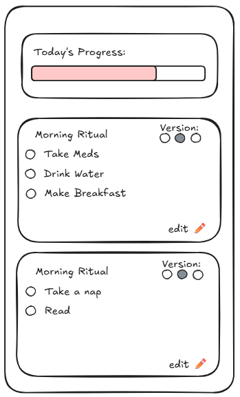
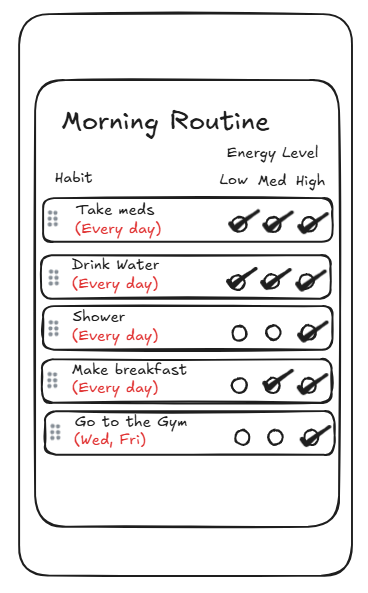
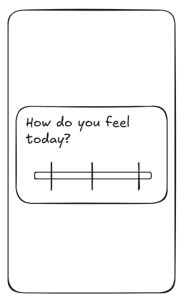

# Habits App

A habit-tracker especially made for people with chronic illnesses and mental or physical illnesses or disabilities, but it can help anyone. Habits takes into account your energy and wellness levels to help you adjust your daily routines to your current needs. This app is based on self-improvement through empathy and grace rather than shame and punishment.

## Features

- Daily habit tracking
	- Input screen
	- Completion Screen
- Routines
	- Group into routines
- Energy levels
	- Daily energy level prompt
	- Create alternate routines for different energy levels
	- Prompt determines default routine
	- User always retains full power, the routine "level" can be changed regardless of energy level response

## Pages / Plan

## Future Features

- Customize # of energy levels
	- Add settings page
- Gamification
	- optional, can be turned on and off in settings
	- Details TBD